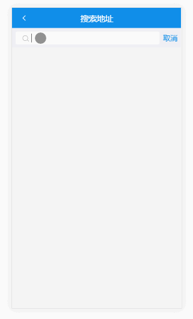

使用 create-react-app 创建的一个简单 demo，接口用的饿了么移动端的接口，使用 fetch 请求数据

项目主要有四个组件
- MainPage , 它有四个子组件，通过底部 footer 切换子组件，默认进入 Msite 组件，判断 localStorage 中有没有 address ，没有的话去 Address 组件选择地址再进入 Msite 组件
  - Msite , 主页
  - Discover , 发现页
  - Order , 订单页
  - User，用户页
- Search 组件，搜索商品和店铺，通过 Msite 组件进入
- Foods 组件，通过 Msite 的轮播图进入

本来想用 githu bpages 演示的，但是 build 后在 package.json 中的跨域设置失效，请求数据失败，所以使用 gif 图演示了

